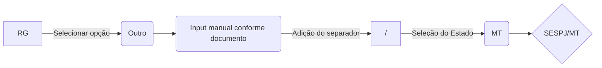

# Alteração  indicadas na Forma de Inserção de Dados no Ecoleta

## Profissão
 > Tanto em Conjuge como em Beneficiários

Necessário mudar a forma de anexar a informação no Ecoleta, trocar de "Input", onde o usuário insere manualmente as informações, para caixa de seleção "Dropdown":

Lista de profissões Sugeridas:
>https://github.com/dev-vra/alt_ecoleta/blob/main/profissoes.md

> Adicionar as opções a opção: "Outro" - Para casos de erro de digitação contidos no documento.

## Estado Civil
- Alterar opções de seleção para:
	- Solteiro(a), Casado(a), Divorciado(a), Viúvo(a), União Estável
- Criar regra para caso de seleção da opção "União Estável"
	- Campo "Regime de casamento" deve ser: "União Estável"
	- Campo "Estado Civil União Estável" deve ser obrigatóriamente Preenchido com:
		- Solteiro(a), Divorciado(a), Viúvo(a),

## Nacionalidade
Necessário mudar a forma de anexar a informação no Ecoleta, trocar de "Input", onde o usuário insere manualmente, para "Caixa de Seleção" com duas opções:

- Brasileiro (a)
- Outro 
	- Acompanhado de uma caixa para Input de Texto

## Editar seção do RG 
 > Tanto em Conjuge como em Beneficiários

Necessário mudar a forma de anexar a informação no Ecoleta, trocar de "Input", onde o usuário insere manualmente as informações, para 2 caixas de seleção "Dropdown":
> Adicionar as opções a opção: "Outro" - Para casos de erro de digitação contidos no documento.

 - Orgão Expedidor
 - Estado Emissor
> https://github.com/dev-vra/alt_ecoleta/blob/main/Estado.md

> https://github.com/dev-vra/alt_ecoleta/blob/main/Orgao.md

### Fluxo de Seleção padrão

### Fluxo de Seleção em caso erro de digitação

